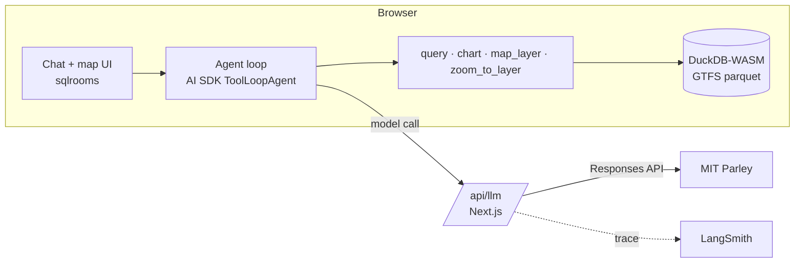

# MBTA GTFS Agent

> Submitted for the **Agentic AI** RA track.
> Live demo: <https://mbta-gtfs-agent.vercel.app/> (username and password are in the submission email) · [Demo videos](#walkthrough) · [Run it locally](#run-it)

A chat interface over the MBTA static GTFS feed for service planners. You ask a question in plain English; the agent writes DuckDB SQL, runs it in your browser, and answers with a table, chart or map. Every answer is auditable: it shows the SQL that produced it, the service date it used, and the caveats behind the number, so a planner can check the result, re-run it, or change it.

<!-- TODO screenshot: docs/img/q2.png (chat + map) -->

## Why this is worthwhile

GTFS is a relational dataset: routes, trips, stop times, stops and calendars joined by keys, with calendar exceptions, times past 24:00, short-turn patterns and parent stations layered on top. Answering "which routes are frequent on a weekday?" correctly means writing several joins and getting every one of those details right. Today that is SQL or Excel work, and it is easy to get subtly wrong.

This prototype lets a planner who does not write SQL, and does not know the GTFS schema, explore the feed in plain English. The agent writes the SQL, runs it, and returns a table, an interactive chart or a map. One question that used to cost half a day now costs a minute, so a planner can iterate: ask, look, refine, ask again.

The answers are not black boxes. The SQL behind every number is shown next to it, can be opened in an editor, edited and re-run. A number a planner cannot audit is a number they cannot act on, so auditability is the point, not a feature.

Everything runs in the browser (DuckDB-WASM) except the model call. The data never leaves the machine, and a small agency can stand the tool up with a single API key. Uploading a second feed makes season-over-season comparison, a routine planning task, a one-line question.

## What it does

Four tools, all running in the browser against DuckDB-WASM, plus one that talks to the user:

| Tool | Used when | Output |
|---|---|---|
| `ask_user` | the question leaves out a detail that changes the answer (day, hours, place, threshold) | multiple-choice questions, with a free-text "other" |
| `query` | always first | table + the SQL that produced it (editable, re-runnable, exportable to CSV) |
| `chart` | the result has a time axis (hour, period, date) | Vega-Lite chart; click a legend entry to isolate a series; export SVG/PNG |
| `map_layer` + `zoom_to_layer` | the answer is a set of routes or stops | deck.gl layer on the map, coloured by GTFS `route_color` or by the metric, then the map flies to it |

**Why `ask_user`.** In my experience building agentic systems, a bad answer is often not the model's fault or the harness's fault: the question was underspecified. For spatiotemporal data this is the norm. "Which routes are frequent?" has no answer until you fix the day type, the hours and what "frequent" means in minutes. So the agent checks three dimensions (time, place, metric) before it runs anything. If one is missing and would change the result, it asks once, with at most three multiple-choice questions and an "other" field for free text. If everything is given or has a sensible default, it does not ask; it states the defaults it applied in the caveats. Multiple choice rather than open questions keeps the exchange short and the user in control, without an agent doing a lot of work toward an answer nobody wanted.

Every answer follows the same four parts:

1. **Service date** used (`YYYYMMDD` + weekday) and feed version
2. **Result**
3. **Caveats**: reference stop, excluded trips, merged stops, "scheduled, not actual"
4. **How I computed this**: one line

The agent knows today's date in Boston and resolves "weekday", "Saturday", "tomorrow" to a concrete date inside the feed window.

## Walkthrough

Three short videos (embedded on the [docs site](https://godspeedhuang.github.io/mbta-gtfs-agent/); on GitHub, click a thumbnail to watch on YouTube). Each starts from a suggestion card on the welcome screen; the follow-ups are typed. Findings are summarised here; the details are in the videos.

### 1. Ask before computing

[](https://youtu.be/lN2tzmZHKNU)

**"Which bus routes are frequent?"** The question names no day and no threshold, so the agent asks: which day type, and how many minutes count as frequent. With weekday, ≤ 15 min and all five periods (AM peak, midday, PM peak, evening, late night) chosen, it returns the qualifying routes per period, draws them on the map, and states the reference stop, the excluded trips, and how it computed the result.

Finding: 25 bus routes plus 6 Silver Line routes keep a median scheduled headway of 15 minutes or better in every period on a weekday.

Shows: `ask_user`, `query`, `map_layer`, and the fixed answer layout (service date, result, caveats, how it was computed). *Every answer shows its SQL, so it can be reproduced and verified.*

### 2. Chart, compare, map

[](https://youtu.be/5d7BHqwO9k0)

**"What is the scheduled headway on Route 1 by hour on a weekday?"** The agent returns an interactive chart, not a static image: click a legend entry to isolate a direction, export it as SVG or PNG, or open the SQL that produced it. The answer names the reference stop for each direction and notes GTFS hours 24 and 25.

**"Compare it with Route 66, weekday AM peak vs Saturday AM peak."** A comparison table by route and direction, with the trips excluded as atypical listed in the caveats. The relevant routes and stops are then drawn on the map with deck.gl.

Finding: Route 1 runs every 8–10 minutes in the peaks and widens to 14–15 minutes overnight. On Saturday mornings both routes settle at roughly 11–13 minutes, so the weekday gap between them disappears.

Shows: `chart`, `query`, `map_layer`, the headway definition (median gap at the first stop shared by all typical trips, never `60 / trips`).

### 3. Upload, compare seasons, export, edit

[](https://youtu.be/Q8WIS2Ajies)

**Drop the Summer 2026 feed into the data panel.** It loads into its own DuckDB schema next to the bundled Fall feed, and its tables can be browsed right away in the table view.

**"Which bus routes gained or lost weekday trips from Summer 2026 to Fall 2026?"** The agent joins the two schemas, lists the routes whose weekday trip count changed, and colours them on the map by the size of the change. Every intermediate table keeps its SQL. The result can be exported to CSV to join other analyses, and the SQL can be opened in the editor, changed and re-run when the analyst wants to try a different comparison.

Finding: comparing the two feeds on the dates the agent chose (2026-09-02 vs 2026-09-09), 28 bus routes changed their weekday trip count; most changes are small.

Shows: feed upload, table view, cross-schema SQL, CSV export, the SQL editor.


## Key findings

These are findings about building the agent, not about the MBTA schedule; the schedule findings are under each video above. The numbers are from [What the evaluation found](#what-the-evaluation-found) at the end of this document.

1. **Clarifying before computing is the biggest quality lever.** Without `ask_user`, the same model answered "which bus routes are frequent?" with 2, 33 and 23 routes across three runs, each defensible, none necessarily what the planner meant. With it, the agent asked on every vague question and never on a clear one, in a fraction of the time guessing took. A stronger model does not remove this variance, because it comes from the question, not from the SQL. See [Clarifying before computing](#clarifying-before-computing).

2. **Medium reasoning effort is the sweet spot, and the open-weight model is not there yet.** High effort costs more for the same accuracy; Gemini gets every table right but over-draws charts at 11× the cost; Llama 4 Maverick gets the table right about a quarter of the time. See the [comparison table](#what-the-evaluation-found).

3. **GTFS answers are date-sensitive, so the agent needs to know what day it is.** Service on a date is a calendar rule plus exceptions, and "weekday" or "this Saturday" only mean something relative to today. The system prompt embeds today's date in Boston, the rules for resolving relative dates inside the feed window, and the instruction to state the resolved date in every answer. The Summer-vs-Fall comparison shows why: 28 changed routes on one pair of Wednesdays, 59 on another, both correct.

4. **Map colours should be the agency's, not the tool's.** Routes on the map use GTFS `route_color`, with a lighter shade for the return direction, so the Silver Line is silver and the Red Line is red. A planner recognises the network at a glance; a categorical palette would make them read a legend first.

5. **GTFS is complex, but a current LLM writes correct SQL against it once the schema is spelled out.** The system prompt lists the tables, the join keys, the calendar rule, the past-24:00 time format, the parent-station rule and the MBTA `route_patterns` typicality codes. With that in place, data accuracy was 100% on every clear question at medium effort, including the cross-feed join, which needed nothing beyond a second schema and one paragraph of instructions (see [Comparing two feeds](#comparing-two-feeds)). The hard part is no longer the SQL; it is deciding what the question means.

## Design for trust

**Making answers checkable**

- **SQL visible and editable** for every table: open it, change it, re-run it in place, export the rows as CSV
- **Resolved service date** stated in every answer; relative dates ("weekday", "this Saturday") resolved from today's Boston date inside the feed window
- **Definitions in the prompt**, not left to the model: headway = median gap at the first stop shared by all typical (`typicality = 1`) trips, never `60 / trips`; period boundaries half-open; a threshold judged on the worse direction
- **Caveats are mandatory**: every answer names the reference stop, the trips excluded as atypical, any merged stops, and that this is scheduled service, not actual operations
- **Reference SQL as a CI gate**: every push runs hand-written reference queries against the pinned parquet feed and asserts the key numbers, so a change to the prompt or the data that breaks a definition fails the build

**Keeping the agent in bounds**

- **Ask before computing**: when day, hours, place or threshold is missing and would change the answer, the agent asks with multiple choice instead of guessing; when it applies a default, the default is written into the caveats
- **Guardrails**: read-only SQL (`SELECT`/`WITH` only), `LIMIT 1000` appended when absent, at most 2 retries on a SQL error, a cap of 20 tool steps, and a refusal for real-time or historical-operations questions. These run in a browser sandbox, so they are design signals, not a security boundary.
- **The API key never reaches the browser**: model calls go through a server proxy that holds the key and pins model and reasoning effort; the browser sends only a menu index, so it cannot call a model that is not listed
- **Every model call is traced** to LangSmith with its input messages, tool calls, reasoning summary, output and token usage, grouped by chat session

## Architecture



The GTFS data and all tool execution stay in the browser. The server is a thin model proxy: it holds the API key, pins model and reasoning effort, and traces each call.

Why these choices, and what I'd change at larger scale: [ASSUMPTIONS.md → Technology choices](ASSUMPTIONS.md#technology-choices)

## Data and resources

**Data**
- MBTA static GTFS, feed *Fall 2026, version D* (valid 2026-09-04 → 2026-12-12), downloaded 2026-09-12 from <https://cdn.mbta.com/MBTA_GTFS.zip>. Converted to parquet by `scripts/prepare-gtfs.ts` and committed under `public/gtfs/` (~14 MB) so results are reproducible.
- MBTA GTFS extensions used: `route_patterns` (typicality), `directions`.
- Basemap: CARTO Dark Matter (© CARTO, © OpenStreetMap contributors).

**Open-source resources**
- [sqlrooms](https://sqlrooms.org/) 0.29 — room shell, DuckDB-WASM, AI chat slice, Vega and deck.gl integrations; started from its `ai-nextjs` example
- [Vercel AI SDK](https://ai-sdk.dev/) 6 with `@ai-sdk/openai` (Responses API)
- DuckDB-WASM, deck.gl 9.3, MapLibre GL, Vega-Lite, Next.js 16
- LangSmith JS SDK for tracing

<!-- TODO: anything else you referenced (TransitGPT? MBTA GTFS docs?) -->

## Compute

| Resource | Tier | Used for |
|---|---|---|
| MIT Parley API | <!-- TODO tier, e.g. free MIT student access --> | all model calls; model `gpt-5.6-luna`, reasoning effort `medium`, via the OpenAI Responses API |
| Laptop | <!-- TODO model / RAM --> | DuckDB-WASM queries run in the browser |
| Vercel | Hobby (free) | live demo |
| LangSmith | <!-- TODO tier --> | tracing |
| GitHub Actions | free | CI |

No paid subscriptions were purchased for this task.

## Run it

Requires Node ≥ 22 and pnpm.

```bash
cp .env.example .env    # set OPENAI_API_KEY
pnpm install
pnpm dev                # http://localhost:3000
```

**Docker**

```bash
docker compose up --build
```

**Environment variables**

| Variable | Required | Notes |
|---|---|---|
| `OPENAI_BASE_URL` | yes | any OpenAI-compatible endpoint; defaults to Parley in `.env.example` |
| `OPENAI_API_KEY` | yes | server-side only |
| `LANGSMITH_TRACING`, `LANGSMITH_API_KEY`, `LANGSMITH_PROJECT` | no | tracing |
| `BASIC_AUTH_USER`, `BASIC_AUTH_PASSWORD` | no | password-protects the whole app when both are set |

**Models.** The chat's model menu comes from [`models.json`](models.json); the first entry is the default. Add a model with one line, `{"model": "<id from GET $OPENAI_BASE_URL/models>"}`. Optional fields: `label`, `note`, `effort` (`none`–`high`, default `none`) and `api` (`chat` by default; `responses` for OpenAI models, which streams reasoning summaries). The browser sends only the menu position, so users can't call a model that isn't listed.

**Checks**

```bash
pnpm test               # unit tests (SQL guard, chart enhancer, date)
pnpm eval --data-only   # reference SQL for the demo questions against the parquet feed
```

CI runs install, tests, the data eval and a production build on every push.

## Limitations and future work

<!-- TODO in your own words. Candidates:
- Scheduled service only. Next step: a server-side GTFS-RT tool so Q6 gets a real answer (actual gaps vs scheduled).
- Single agency, one pinned feed; no upload.
- Agent eval (model answers vs reference numbers) is not automated yet; only the data side runs in CI.
- Harvard-style stop merging is a distance heuristic.
- Shared Basic Auth credentials and no per-user rate limit on the model proxy.
- Scaling path: ASSUMPTIONS.md, Technology choices
-->

## Observability and evaluation

An agent that writes SQL for planners is only useful if its numbers are right, and "right" has to be measured, not eyeballed. This section covers what is instrumented, how answers are evaluated, what the evaluation found, and what comes next.

### Observability

**Now: LangSmith.** Every model call goes through the server gateway and is traced as one run with its input messages, tool calls, reasoning summary, output and token usage. Runs from one chat session are grouped into a thread, so a whole conversation (question → queries → retries → answer) can be replayed step by step.

Traces are how problems like these were diagnosed during development: the agent giving up after a single SQL error instead of fixing the query, and the agent constructing a `shape_id` that matched no route geometry.

**Next: Langfuse.** For the open-source release, agencies need a tracing backend they can host themselves. Langfuse covers the same ground (traces, threads, token and cost accounting, evaluation datasets) and is self-hostable, so it replaces LangSmith at Tier 1 without changing what is recorded.

**Not yet instrumented:** tool-level timing (how long each query took, how many rows it returned), per-user usage, latency budgets and alerts.

### Evaluation

#### Golden dataset

`eval/questions.json` holds two kinds of question.

**Clear questions** have a prompt, the tools a correct run needs, optional tools that are acceptable, a reference SQL query written and checked by hand, and the key values a correct answer must contain (e.g. Route 1 weekday AM peak median = 8 minutes). The agent should answer them without asking anything.

| Question | Required tools | Key values |
|---|---|---|
| Q1 Route 1 headway by hour | query, chart | 8, 10 |
| Q2 Bus routes ≤10 min in AM peak | query, map_layer, zoom_to_layer | 1, 66, 111 |
| Q3 Routes serving Harvard | query, map_layer, zoom_to_layer | 66, Red, 71 |
| Q4 Route 1 vs 66, weekday vs Saturday | query (chart optional) | 8, 9, 13, Saturday |
| Q6 Is Route 1 on time right now? | none (query optional) | "schedule" |
| Q7 Routes that gained or lost weekday trips, Summer → Fall 2026 | query, map_layer, zoom_to_layer | 65 (+45), 66, 70, 746/SLW |

Q7 needs a second feed. The Summer 2026 archive is converted locally with the same script (`pnpm prepare-gtfs <src> <out>`) and mounted as the `summer_2026` schema, exactly as an upload in the app would be. It is not committed, so CI skips Q7 and reports that it did.

**Vague questions** leave out something that changes the answer. The agent should ask before computing, and its questions should cover the dimensions that are actually missing.

| Question | What is missing |
|---|---|
| V1 Which bus routes are frequent? | day; what "frequent" means |
| V2 How often do buses run downtown? | where "downtown" is; day |
| V3 Which stops are the busiest? | what "busiest" means; day |

#### Two levels

**1. Data check (runs in CI, no model).** Each reference SQL runs against the Parquet feed in Node DuckDB and must produce the key values. This catches a changed feed, a broken conversion script, or a wrong definition before anything reaches the model. It runs on every push.

**2. Agent check (run on demand).** The same agent, prompt and tool definitions as the app, with tools executed in Node against the same data. For each run it records:

| Metric | Meaning |
|---|---|
| **Answer accuracy** | clear questions: the key values appear in the final answer text |
| **Data accuracy** | clear questions: the key values appear in a successful query result, i.e. the table the planner sees |
| **Tool precision / recall** | clear questions: share of tools used that were required or acceptable / share of required tools used |
| **Asks when vague** | share of vague-question runs where the agent asked before computing |
| **Asks when clear** | share of clear-question runs where it asked anyway (over-asking) |
| **Coverage** | share of a vague question's missing dimensions its clarifying questions addressed |
| **Time, tokens, cost** | per question; cost is the billed USD from Parley's per-request cost header |

Answer and data accuracy are kept separate on purpose. The prompt tells the agent not to paste raw rows into the answer, so a model can compute the right table and still write a vague summary. Those are different failures with different fixes.

Each configuration runs every question three times, because the same model can take a different path on each run. A control group runs the vague questions with the clarifying tool removed.

#### What the evaluation found

**Comparison** (8 questions × 3 runs per configuration, 2026-09-14; `pnpm eval --summary`)

| Model | Effort | Answer acc. | Data acc. | Tool P / R | Asks when vague | Asks when clear | Coverage | Sec / q | Tokens / q | USD / q |
|---|---|---|---|---|---|---|---|---|---|---|
| gpt-5.6-luna | low | 87% | 93% | 1.00 / 0.91 | 100% | 0% | 100% | 14.3 | 14k | $0.0022 |
| gpt-5.6-luna | medium | 93% | 100% | 1.00 / 1.00 | 100% | 0% | 100% | 24.9 | 23k | $0.0034 |
| gpt-5.6-luna | high | 93% | 100% | 0.91 / 1.00 | 100% | 0% | 100% | 25.8 | 22k | $0.0042 |
| gemini-3.6-flash | medium | 80% | 100% | 0.66 / 1.00 | 100% | 0% | 100% | 25.7 | 35k | $0.0385 |
| llama-4-maverick-17b | — | 13% | 27% | 0.77 / 0.58 | 100% | 20% | 72% | 4.9 | 9k | $0.0027 |

GPT runs through the Responses API; Gemini and Llama through Chat Completions. The 129 agent runs, including the control group, cost $1.27.

- **Medium effort is the sweet spot.** High effort adds cost without adding accuracy; low effort is faster and cheaper but misses more (one table wrong, one required tool skipped).
- **Gemini computes the right tables but over-acts.** Data accuracy is 100%, but it draws charts and maps nobody asked for (tool precision 0.66) and sometimes leaves a key number out of the answer, at about 11× the cost per question of gpt-5.6-luna.
- **The open-weight model is not enough for this loop.** Llama 4 Maverick gets the table right about a quarter of the time, asks unnecessary questions on clear requests, and misses part of what is ambiguous on vague ones. Self-hosting is viable only with a stronger open-weight model; this is the number to re-measure as those improve.

#### Clarifying before computing

This is the result I care most about. With the clarifying tool, every GPT and Gemini configuration asked on every vague question, covered every missing dimension, and never asked on a clear one. The questions are multiple choice with a recommended option, e.g. for "Which bus routes are frequent?": *Day* (weekday / Saturday / Sunday), *Threshold* (≤10 / ≤15 / ≤20 minutes, both directions), *Hours* (all periods / peaks / daytime).

Without it, the same model guesses, and guesses differently each time. The control group (gpt-5.6-luna, medium, three runs per vague question):

| Question | Run 1 | Run 2 | Run 3 |
|---|---|---|---|
| Which bus routes are frequent? | Wednesday, ≤15 min in any period and direction → **2 routes** | Wednesday, ≤15 min in daytime → **33 routes** | Sunday, ≤15 min at midday → **23 routes** |
| How often do buses run downtown? | Downtown Crossing, Sunday | asked in plain text instead of answering | Downtown Crossing, Sunday |
| Which stops are the busiest? | departures per platform: Forest Hills 1,207 | same | departures per station: Forest Hills 1,747 |

Every one of those answers is defensible, and each states its assumptions in the caveats. None of that helps a planner who meant something else, and the guessing runs also took about 30 seconds per question against 4–5 seconds to ask. A stronger model does not remove this variance, because it comes from the question, not from the model's ability to write SQL. Once time, place and metric are pinned down, the SQL is the easy part.

Two lessons from tuning the rule:
- **Defaults prevent over-asking.** "Weekday" already resolves to the next Wednesday, and a given threshold is judged on the worse direction, so neither triggers a question. An earlier version of the prompt asked "which direction?" on clear questions in 20% of runs until direction got a default.
- **Asking has a UX cost, so the form of the question depends on the ambiguity.** One obvious reading ("Harvard"): no question, the assumption goes in the caveats. One likely reading ("the Coop"): a yes/no confirmation, "Yes, Harvard Coop" or "No, something else". Several readings ("downtown"): multiple choice with a recommended option. Each is one click; free text is always available.

#### Comparing two feeds

Q7 (gpt-5.6-luna, medium, three runs) got the table right every time: it picked a Wednesday inside each feed's window, applied the calendar rule per feed, and joined on `route_id`. Two of the three answers named route 746 by its public name, SLW, which the expectation now accepts. About 28 seconds and 24k tokens per run; the map colours each route by its change in trips. The point of the question is less the numbers than that nothing had to change for the agent to answer it: the schema per feed and one paragraph of instructions were enough.

**Definition problems the evaluation surfaced**

- **Period boundaries.** The reference SQL treated the AM peak as 07:00–09:00 *inclusive*; the agent treated it as half-open. For Route 66 that is 9.5 vs 9 minutes. Periods are adjacent (midday starts at 09:00), so half-open is correct: the reference SQL was wrong, not the agent. The prompt now states the rule explicitly.
- **"Every 10 minutes or better" was ambiguous about direction.** One run counted a route if either direction met the threshold (21 routes), the reference used the worse direction (20). The prompt now makes the worse direction the default.

### Next steps

- **LLM-as-judge.** Substring matching checks that numbers are present, not that the answer is good. A judge model with a rubric would score correctness against the reference result, conciseness, whether caveats (reference stop, excluded trips, scheduled vs actual) are stated, and whether the resolved service date is given. Judge scores need spot-checking against human ratings before they are trusted.
- **Trajectory evaluation beyond tool sets.** Compare the order of tool calls and the SQL itself against the reference (same service date, typicality filter, reference stop), not just which tools were used.
- **Larger golden set from real planner questions,** including more that the agent should decline or clarify, and scoring whether the options it offers are the right ones, not only whether it asked.
- **Evaluation as a gate.** Run the agent check on prompt or model changes and block a release when accuracy drops, the same way the data check already gates every push.

Hours spent: <!-- TODO N -->
