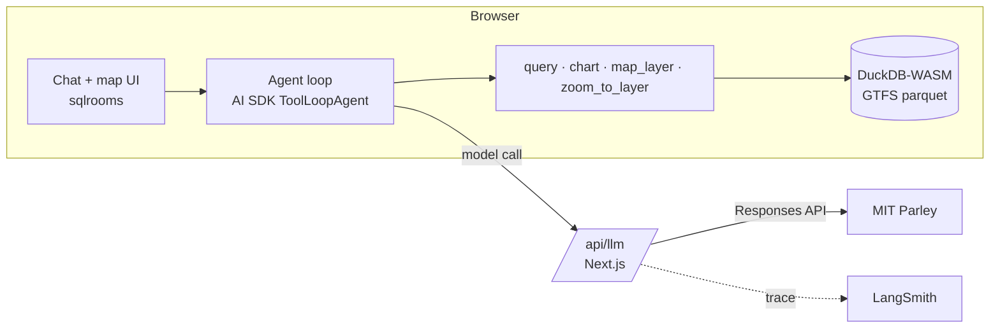

# MBTA GTFS Agent

> Submitted for the **Agentic AI** RA track.
> Live demo: <https://mbta-gtfs-agent.vercel.app/> (username and password are in the submission email) · [Demo videos](#walkthrough) · [Run it locally](#run-it)

A chat interface over the MBTA static GTFS feed for service planners. You ask a question in plain English; the agent writes DuckDB SQL, runs it in your browser, and answers with a table, chart or map. Every answer is auditable: it shows the SQL that produced it, the service date it used, and the caveats behind the number, so a planner can check the result, re-run it, or change it.

<!-- TODO screenshot: docs/img/q2.png (chat + map) -->

## Why this is worthwhile

GTFS is a relational dataset: routes, trips, stop times, stops and calendars joined by keys, with calendar exceptions, times past 24:00, short-turn patterns and parent stations layered on top. Answering "which routes are frequent on a weekday?" correctly means writing several joins and getting every one of those details right. Today that is SQL or Excel work, and it is easy to get subtly wrong.

This prototype lets a planner who does not write SQL, and does not know the GTFS schema, explore the feed in plain English. The agent writes the SQL, runs it, and returns a table, an interactive chart or a map. One question that used to cost half a day now costs a minute, so a planner can iterate: ask, look, refine, ask again.

The answers are not black boxes. The SQL behind every number is shown next to it, can be opened in an editor, edited and re-run. A number a planner cannot audit is a number they cannot act on, so auditability is the point, not a feature.

Everything runs in the browser (DuckDB-WASM) except the model call. The data never leaves the machine, and a small agency can stand the tool up with a single API key. Uploading a second feed makes season-over-season comparison, a routine planning task, a one-line question.

## What it does

Four tools, all running in the browser against DuckDB-WASM, plus one that talks to the user:

| Tool | Used when | Output |
|---|---|---|
| `ask_user` | the question leaves out a detail that changes the answer (day, hours, place, threshold) | multiple-choice questions, with a free-text "other" |
| `query` | always first | table + the SQL that produced it (editable, re-runnable, exportable to CSV) |
| `chart` | the result has a time axis (hour, period, date) | Vega-Lite chart; click a legend entry to isolate a series; export SVG/PNG |
| `map_layer` + `zoom_to_layer` | the answer is a set of routes or stops | deck.gl layer on the map, coloured by GTFS `route_color` or by the metric, then the map flies to it |

**Why `ask_user`.** In my experience building agentic systems, a bad answer is often not the model's fault or the harness's fault: the question was underspecified. For spatiotemporal data this is the norm. "Which routes are frequent?" has no answer until you fix the day type, the hours and what "frequent" means in minutes. So the agent checks three dimensions (time, place, metric) before it runs anything. If one is missing and would change the result, it asks once, with at most three multiple-choice questions and an "other" field for free text. If everything is given or has a sensible default, it does not ask; it states the defaults it applied in the caveats. Multiple choice rather than open questions keeps the exchange short and the user in control, without an agent doing a lot of work toward an answer nobody wanted.

Every answer follows the same four parts:

1. **Service date** used (`YYYYMMDD` + weekday) and feed version
2. **Result**
3. **Caveats**: reference stop, excluded trips, merged stops, "scheduled, not actual"
4. **How I computed this**: one line

The agent knows today's date in Boston and resolves "weekday", "Saturday", "tomorrow" to a concrete date inside the feed window.

## Walkthrough

Three short videos (embedded on the [docs site](https://godspeedhuang.github.io/mbta-gtfs-agent/); on GitHub, click a thumbnail to watch on YouTube). Each starts from a suggestion card on the welcome screen; the follow-ups are typed. Findings are summarised here; the details are in the videos.

### 1. Ask before computing

[](https://youtu.be/lN2tzmZHKNU)

**"Which bus routes are frequent?"** The question names no day and no threshold, so the agent asks: which day type, and how many minutes count as frequent. With weekday, ≤ 15 min and all five periods (AM peak, midday, PM peak, evening, late night) chosen, it returns the qualifying routes per period, draws them on the map, and states the reference stop, the excluded trips, and how it computed the result.

Finding: 25 bus routes plus 6 Silver Line routes keep a median scheduled headway of 15 minutes or better in every period on a weekday.

Shows: `ask_user`, `query`, `map_layer`, and the fixed answer layout (service date, result, caveats, how it was computed). *Every answer shows its SQL, so it can be reproduced and verified.*

### 2. Chart, compare, map

[](https://youtu.be/5d7BHqwO9k0)

**"What is the scheduled headway on Route 1 by hour on a weekday?"** The agent returns an interactive chart, not a static image: click a legend entry to isolate a direction, export it as SVG or PNG, or open the SQL that produced it. The answer names the reference stop for each direction and notes GTFS hours 24 and 25.

**"Compare it with Route 66, weekday AM peak vs Saturday AM peak."** A comparison table by route and direction, with the trips excluded as atypical listed in the caveats. The relevant routes and stops are then drawn on the map with deck.gl.

Finding: Route 1 runs every 8–10 minutes in the peaks and widens to 14–15 minutes overnight. On Saturday mornings both routes settle at roughly 11–13 minutes, so the weekday gap between them disappears.

Shows: `chart`, `query`, `map_layer`, the headway definition (median gap at the first stop shared by all typical trips, never `60 / trips`).

### 3. Upload, compare seasons, export, edit

[](https://youtu.be/Q8WIS2Ajies)

**Drop the Summer 2026 feed into the data panel.** It loads into its own DuckDB schema next to the bundled Fall feed, and its tables can be browsed right away in the table view.

**"Which bus routes gained or lost weekday trips from Summer 2026 to Fall 2026?"** The agent joins the two schemas, lists the routes whose weekday trip count changed, and colours them on the map by the size of the change. Every intermediate table keeps its SQL. The result can be exported to CSV to join other analyses, and the SQL can be opened in the editor, changed and re-run when the analyst wants to try a different comparison.

Finding: comparing the two feeds on the dates the agent chose (2026-09-02 vs 2026-09-09), 28 bus routes changed their weekday trip count; most changes are small.

Shows: feed upload, table view, cross-schema SQL, CSV export, the SQL editor.


## Key findings

These are findings about building the agent, not about the MBTA schedule; the schedule findings are under each video above. The numbers are from [docs/observability-evaluation.md](docs/observability-evaluation.md#what-the-evaluation-found) (optional).

1. **Clarifying before computing is the biggest quality lever.** Without `ask_user`, the same model answered "which bus routes are frequent?" with 2, 33 and 23 routes across three runs, each defensible, none necessarily what the planner meant. With it, the agent asked on every vague question and never on a clear one, in a fraction of the time guessing took. A stronger model does not remove this variance, because it comes from the question, not from the SQL. See [Clarifying before computing](docs/observability-evaluation.md#clarifying-before-computing).

2. **Medium reasoning effort is the sweet spot, and the open-weight model is not there yet.** High effort costs more for the same accuracy; Gemini gets every table right but over-draws charts at 11× the cost; Llama 4 Maverick gets the table right about a quarter of the time. See the [comparison table](docs/observability-evaluation.md#what-the-evaluation-found).

3. **GTFS answers are date-sensitive, so the agent needs to know what day it is.** Service on a date is a calendar rule plus exceptions, and "weekday" or "this Saturday" only mean something relative to today. The system prompt embeds today's date in Boston, the rules for resolving relative dates inside the feed window, and the instruction to state the resolved date in every answer. The Summer-vs-Fall comparison shows why: 28 changed routes on one pair of Wednesdays, 59 on another, both correct.

4. **Map colours should be the agency's, not the tool's.** Routes on the map use GTFS `route_color`, with a lighter shade for the return direction, so the Silver Line is silver and the Red Line is red. A planner recognises the network at a glance; a categorical palette would make them read a legend first.

5. **GTFS is complex, but a current LLM writes correct SQL against it once the schema is spelled out.** The system prompt lists the tables, the join keys, the calendar rule, the past-24:00 time format, the parent-station rule and the MBTA `route_patterns` typicality codes. With that in place, data accuracy was 100% on every clear question at medium effort, including the cross-feed join, which needed nothing beyond a second schema and one paragraph of instructions (see [Comparing two feeds](docs/observability-evaluation.md#comparing-two-feeds)). The hard part is no longer the SQL; it is deciding what the question means.

## Design for trust

**Making answers checkable**

- **SQL visible and editable** for every table: open it, change it, re-run it in place, export the rows as CSV
- **Resolved service date** stated in every answer; relative dates ("weekday", "this Saturday") resolved from today's Boston date inside the feed window
- **Definitions in the prompt**, not left to the model: headway = median gap at the first stop shared by all typical (`typicality = 1`) trips, never `60 / trips`; period boundaries half-open; a threshold judged on the worse direction
- **Caveats are mandatory**: every answer names the reference stop, the trips excluded as atypical, any merged stops, and that this is scheduled service, not actual operations
- **Reference SQL as a CI gate**: every push runs hand-written reference queries against the pinned parquet feed and asserts the key numbers, so a change to the prompt or the data that breaks a definition fails the build

**Keeping the agent in bounds**

- **Ask before computing**: when day, hours, place or threshold is missing and would change the answer, the agent asks with multiple choice instead of guessing; when it applies a default, the default is written into the caveats
- **Guardrails**: read-only SQL (`SELECT`/`WITH` only), `LIMIT 1000` appended when absent, at most 2 retries on a SQL error, a cap of 20 tool steps, and a refusal for real-time or historical-operations questions. These run in a browser sandbox, so they are design signals, not a security boundary.
- **The API key never reaches the browser**: model calls go through a server proxy that holds the key and pins model and reasoning effort; the browser sends only a menu index, so it cannot call a model that is not listed
- **Every model call is traced** to LangSmith with its input messages, tool calls, reasoning summary, output and token usage, grouped by chat session

## Architecture



The GTFS data and all tool execution stay in the browser. The server is a thin model proxy: it holds the API key, pins model and reasoning effort, and traces each call.

Why these choices, and what I'd change at larger scale: [docs/tech-choices.md](docs/tech-choices.md) (optional reading)

## Data and resources

**Data**
- MBTA static GTFS, feed *Fall 2026, version D* (valid 2026-09-04 → 2026-12-12), downloaded 2026-09-12 from <https://cdn.mbta.com/MBTA_GTFS.zip>. Converted to parquet by `scripts/prepare-gtfs.ts` and committed under `public/gtfs/` (~14 MB) so results are reproducible.
- MBTA GTFS extensions used: `route_patterns` (typicality), `directions`.
- Basemap: CARTO Dark Matter (© CARTO, © OpenStreetMap contributors).

**Open-source resources**

Versions are the ones installed; licenses are from each package's `package.json`. All are permissive (MIT, BSD-3-Clause, Apache-2.0), so the prototype can be released as open source without a copyleft obligation.

| Resource | Used for | Version | License |
|---|---|---|---|
| [sqlrooms](https://github.com/sqlrooms/sqlrooms) | room shell, DuckDB-WASM wiring, AI chat slice, Vega and deck.gl integrations; started from its `ai-nextjs` example | 0.29 | MIT |
| [Vercel AI SDK](https://github.com/vercel/ai) (`ai`, `@ai-sdk/openai`) | agent loop, tool calling, Responses API | 6.0 | Apache-2.0 |
| [DuckDB-WASM](https://github.com/duckdb/duckdb-wasm) | SQL over the GTFS parquet files in the browser | 1.32 | MIT |
| [deck.gl](https://github.com/visgl/deck.gl) | route and stop layers on the map | 9.3 | MIT |
| [MapLibre GL JS](https://github.com/maplibre/maplibre-gl-js) | basemap rendering | 5.24 | BSD-3-Clause |
| [Vega-Lite](https://github.com/vega/vega-lite) / [Vega](https://github.com/vega/vega) | charts | 6.4 | BSD-3-Clause |
| [Next.js](https://github.com/vercel/next.js) | app framework, model proxy route | 16.3 | MIT |
| [LangSmith JS SDK](https://github.com/langchain-ai/langsmith-sdk) | tracing (the hosted LangSmith service itself is not open source) | 0.10 | MIT |

<!-- TODO: anything else you referenced (TransitGPT? MBTA GTFS docs?) -->

## Compute

| Resource | Tier | Used for |
|---|---|---|
| MIT Parley API | <!-- TODO tier, e.g. free MIT student access --> | all model calls; model `gpt-5.6-luna`, reasoning effort `medium`, via the OpenAI Responses API |
| Laptop | <!-- TODO model / RAM --> | DuckDB-WASM queries run in the browser |
| Vercel | Hobby (free) | live demo |
| LangSmith | <!-- TODO tier --> | tracing |
| GitHub Actions | free | CI |

No paid subscriptions were purchased for this task.

## Run it

Requires Node ≥ 22 and pnpm.

```bash
cp .env.example .env    # set OPENAI_API_KEY
pnpm install
pnpm dev                # http://localhost:3000
```

**Docker**

```bash
docker compose up --build
```

**Environment variables**

| Variable | Required | Notes |
|---|---|---|
| `OPENAI_BASE_URL` | yes | any OpenAI-compatible endpoint; defaults to Parley in `.env.example` |
| `OPENAI_API_KEY` | yes | server-side only |
| `LANGSMITH_TRACING`, `LANGSMITH_API_KEY`, `LANGSMITH_PROJECT` | no | tracing |
| `BASIC_AUTH_USER`, `BASIC_AUTH_PASSWORD` | no | password-protects the whole app when both are set |

**Models.** The chat's model menu comes from [`models.json`](models.json); the first entry is the default. Add a model with one line, `{"model": "<id from GET $OPENAI_BASE_URL/models>"}`. Optional fields: `label`, `note`, `effort` (`none`–`high`, default `none`) and `api` (`chat` by default; `responses` for OpenAI models, which streams reasoning summaries). The browser sends only the menu position, so users can't call a model that isn't listed.

**Checks**

```bash
pnpm test               # unit tests (SQL guard, chart enhancer, date)
pnpm eval --data-only   # reference SQL for the demo questions against the parquet feed
```

CI runs install, tests, the data eval and a production build on every push.

## Limitations and future work

The limitations are the simplifications I chose, and each one is written up with its cost and what lifting it takes in [ASSUMPTIONS.md](ASSUMPTIONS.md). The short list:

- **Scheduled service only.** No real-time or historical operations; "is Route 1 on time?" is declined. Next: a server-side GTFS-Realtime tool so that question gets a real answer. ([Scope](ASSUMPTIONS.md#scope))
- **One agency, one pinned feed; uploads are per tab.** A second feed has to be prepared as parquet first and is gone on reload. Next: convert GTFS zips in the browser and keep uploads in OPFS. ([Uploaded feeds and state](ASSUMPTIONS.md#uploaded-feeds-and-state))
- **The agent can only do what SQL plus a chart or map can express.** No files, no code, no background runs. ([Agent](ASSUMPTIONS.md#agent))
- **Guardrails are design signals, not security; access is one shared password.** ([Guardrails and access](ASSUMPTIONS.md#guardrails-and-access))
- **Evaluation checks key numbers, not answer quality, and the agent check is not in CI.** Next: an LLM judge calibrated against human ratings, trajectory checks, a larger golden set. ([Evaluation](ASSUMPTIONS.md#evaluation); plan in [docs/observability-evaluation.md](docs/observability-evaluation.md#next-steps))

Where the stack goes from here (server-side agent, shared uploads, OIDC sign-in, self-hosted tracing) and when each step is worth taking: [docs/tech-choices.md](docs/tech-choices.md), in particular [Deployment by team size](docs/tech-choices.md#deployment-by-team-size).

Hours spent: <!-- TODO N -->
